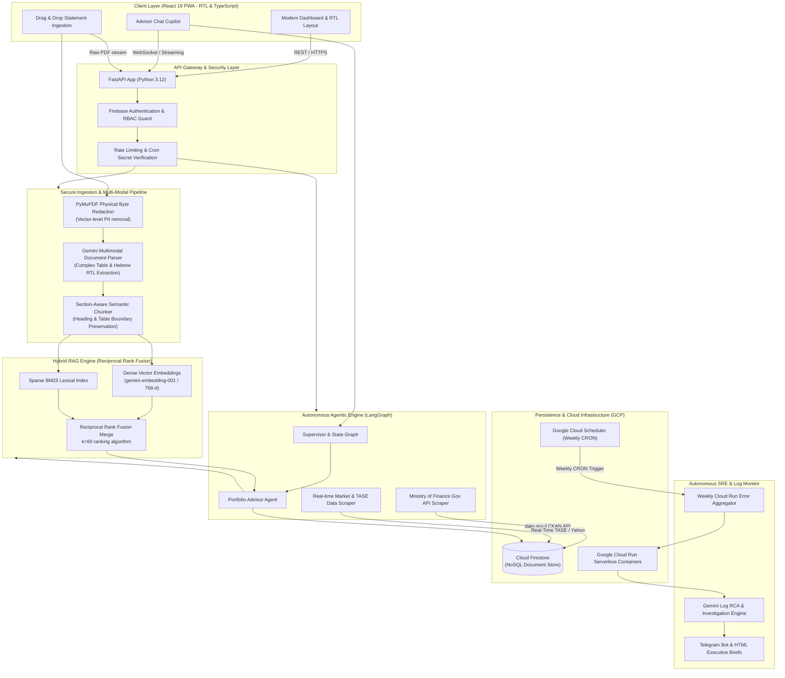

# 🏛️ Family Wealth & Pension Intelligence Engine

[](https://www.python.org/)
[](https://fastapi.tiangolo.com/)
[](https://react.dev/)
[](https://www.typescriptlang.org/)
[](https://langchain-ai.github.io/langgraph/)
[](https://cloud.google.com/)
[](https://tailwindcss.com/)
[](https://playwright.dev/)

> An enterprise-grade, multi-agent financial intelligence and wealth management platform. Built to ingest complex, multi-page Israeli pension, insurance, and brokerage statements, redact sensitive PII at the vector byte level, execute hybrid semantic/lexical RAG over policy contracts, and provide real-time autonomous portfolio reconciliation and advisory.

---

## 📑 Table of Contents
- [System Architecture](#-system-architecture)
- [Core Engineering Pillars](#-core-engineering-pillars)
  - [1. Autonomous Agentic Orchestration (LangGraph)](#1-autonomous-agentic-orchestration-langgraph)
  - [2. Hybrid RAG with Reciprocal Rank Fusion (RRF)](#2-hybrid-rag-with-reciprocal-rank-fusion-rrf)
  - [3. Vector-Level PII Redaction & Multimodal Extraction](#3-vector-level-pii-redaction--multimodal-extraction)
  - [4. Automated Cloud SRE & AI Root-Cause Observability](#4-automated-cloud-sre--ai-root-cause-observability)
  - [5. React 19 PWA & Zero-Dependency SVG Data Visualizations](#5-react-19-pwa--zero-dependency-svg-data-visualizations)
- [Technology Matrix](#-technology-matrix)
- [Security & Access Control](#-security--access-control)
- [Local Development & Quickstart](#-local-development--quickstart)
- [Test Suites & Quality Verification](#-test-suites--quality-verification)

---

## 🏗️ System Architecture



---

## 💎 Core Engineering Pillars

### 1. Autonomous Agentic Orchestration (LangGraph)
- **Multi-Agent State Machine:** Implements discrete, stateful agent nodes using **LangGraph**. The system separates concerns between ingestion analysis, real-time market updates, external government benchmark comparison, and contextual user advisory.
- **Dynamic Tool Calling:** The supervisor agent autonomously decides when to query live financial market data, invoke the internal Hybrid RAG retriever, or query open Israeli government datasets (`data.gov.il`).
- **Defensive Execution:** State transitions enforce schema validations via Pydantic v2, circuit breakers on external HTTP calls, and bounded conversational histories.

### 2. Hybrid RAG with Reciprocal Rank Fusion (RRF)
Financial and insurance policy documents present extreme retrieval edge cases: pure vector search fails on specific clause numbers, sub-section identifiers, and Hebrew legal jargon, while traditional keyword search fails on semantic intent (e.g., matching "אובדן כושר עבודה" with disability coverage).
- **Dual-Stream Retrieval:**
  - **Dense Embeddings:** `gemini-embedding-001` generates 768-dimensional normalized embeddings for semantic alignment.
  - **Sparse Lexical Search:** BM25 scoring tokenizes Hebrew morphology and specific policy IDs.
- **Reciprocal Rank Fusion (RRF):** Blends the top-$K$ candidates across both indices using:
  $$RRF\_Score(d \in D) = \sum_{m \in M} \frac{1}{k + r_m(d)}$$
  *(where $k = 60$, smoothing bias across dense and sparse ranking tiers).*
- **Section-Aware Chunking:** Parses document Markdown maintaining markdown table structures intact and breaking on `##` section headings, preventing fragmented contractual clauses.

### 3. Vector-Level PII Redaction & Multimodal Extraction
- **Physical Byte-Level Sanitization:** Traditional redaction frequently overlays visual black rectangles while leaving underlying text selectable in the PDF stream. This platform uses `PyMuPDF` (`fitz`) to identify national identity numbers, account identifiers, and physical addresses, executing `apply_redactions()` to physically delete the text characters and vector geometry from the raw PDF binary before transmission.
- **Native PDF Multimodal Parsing:** Gemini Vision processes the redacted PDF pages directly, reconstructing complex dual-column Hebrew tabular statements without losing column-to-row financial relationships.

### 4. Automated Cloud SRE & AI Root-Cause Observability
- **Autonomous Error Clustering:** A scheduled Google Cloud Run service queries Cloud Logging for all system warnings and errors over trailing 7-day windows, grouping stack traces by normalized structural error signatures.
- **Automated Root-Cause Analysis (RCA):** An automated Gemini reasoning agent inspects error groups, correlates them with recent commits and file locations, and synthesizes an actionable **AI Investigation Brief**.
- **Dual-Channel Dispatch:** Pushes brief executive summaries to Telegram while dispatching styled HTML diagnostic briefs with reproducible terminal commands to developer inboxes.

### 5. React 19 PWA & Zero-Dependency SVG Data Visualizations
- **Bidi & RTL First:** Engineered specifically for Hebrew Right-To-Left (RTL) ergonomics, with isolated `ltr` sub-trees for currency values (`₪`), percentages, and financial metrics.
- **Custom Zero-Dependency SVG Charts:** Eliminates heavy external charting runtimes. Visualizes portfolio allocations, monthly deposits, and historical compound yields using lightweight, responsive SVG donut and progression primitives.
- **PWA Capabilities:** Service worker caching, offline state persistence with graceful local storage fallback, and instantaneous mobile hydration.

---

## 🛠️ Technology Matrix

| Layer | Technologies | Key Architectural Decisions |
| :--- | :--- | :--- |
| **Backend & APIs** | Python 3.12, FastAPI, Pydantic v2, Uvicorn | Async ASGI runtime; strict typed contracts; dependency injection. |
| **Agentic AI & RAG** | LangGraph, LangChain, Google Gemini, Claude Sonnet | Stateful multi-agent graphs; Hybrid RAG (BM25 + Cosine RRF). |
| **PDF & Vision** | PyMuPDF (fitz), Gemini Multimodal Vision | Vector-level physical PII redaction prior to LLM inference. |
| **Frontend** | React 19, TypeScript 5.4, Vite, Tailwind CSS | Full RTL support; custom SVG charts; zero-dependency UI components. |
| **Database & Auth** | Google Cloud Firestore, Firebase Auth | Multi-tenant family data isolation; granular security rules. |
| **Cloud & DevOps** | Google Cloud Run, Cloud Scheduler, Docker | Serverless container deployments; automated cron monitoring. |
| **Testing & Quality** | Pytest, Playwright, ESLint, TypeScript Strict | End-to-end user journeys; unit test coverage across routers and RAG. |

---

## 🔒 Security & Access Control

1. **Strict Least-Privilege Firestore Rules:** 
   - `/users/{uid}`: Read/write scoped strictly to the authenticated user token.
   - `/families/{familyId}`: Multi-tenant boundary where only authenticated household members and authorized email addresses can access family asset records.
   - `/insurance_chunks/{id}`: Write access restricted entirely to the backend service account; client write attempts are rejected by default.
2. **Deterministic Data Privacy:**
   - Raw user statements are processed in memory and never stored long-term in persistent object storage with unredacted PII.
   - Demo and staging modes run on 100% synthetic mock datasets (`DEMO_FAMILY_PROFILE`).

---

## 🚀 Local Development & Quickstart

### Prerequisites
- Python 3.12+
- Node.js 20+ & npm / pnpm
- Google Cloud Project with Firestore & Vertex/Gemini API enabled (optional for demo mode)

### 1. Clone the Repository
```bash
git clone https://github.com/<your-username>/ai-wealth-monitor.git
cd ai-wealth-monitor
```

### 2. Backend Setup
```bash
cd backend

# Create virtual environment
python -m venv .venv
source .venv/bin/activate  # On Windows: .venv\Scripts\activate

# Install dependencies
pip install -r requirements.txt

# Start FastAPI in development mode
uvicorn app:app --reload --port 8000
```
*The API will be available at `http://localhost:8000` (Swagger docs at `http://localhost:8000/docs`).*

### 3. Frontend Setup
```bash
cd ../frontend

# Install dependencies
npm install

# Start Vite development server
npm run dev
```
*The web application will launch at `http://localhost:5173`.*

> **💡 Zero-Config Demo Mode:** You can explore the complete application without configuring Firebase or LLM API keys by navigating to `http://localhost:5173/?demo=true`. The system will automatically seed realistic synthetic portfolios, pension tracks, and alternative assets in memory.

---

## 🧪 Test Suites & Quality Verification

### Run Backend Unit & Integration Tests
```bash
cd backend
pytest -v
```

### Run Frontend E2E Automation (Playwright)
```bash
cd frontend
npx playwright test
```

---

## 📄 License & Attribution
Distributed under the MIT License. Developed as a flagship showcase of production-grade agentic AI architecture, modern full-stack systems engineering, and financial intelligence.
